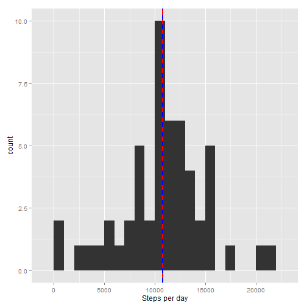
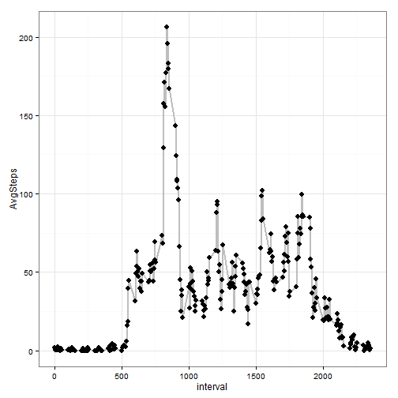
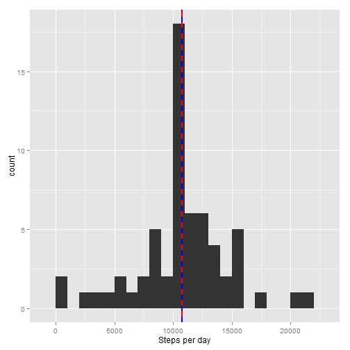
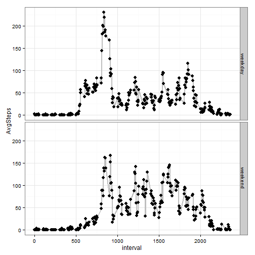

##The following code will use these libraries:

```r
library(dplyr)
library(ggplot2)
```

##Loading and preprocessing the data

```r
library(dplyr)
library(ggplot2)
setwd("~/Coursera/Course5")
activity<-read.csv("activity.csv")
#date should be converted to date not factor
activity$date<-as.Date(activity$date)
```
##What is mean total number of steps taken per day?
 (Ignoring the missing values in the dataset.)
1. Calculate the total number of steps taken per day

```r
TotalPerDay<-activity %>% group_by(date) %>% summarise(StepsPerDay =  sum(steps))
TotalPerDay$StepsPerDay
```

```
##  [1]    NA   126 11352 12116 13294 15420 11015    NA 12811  9900 10304
## [12] 17382 12426 15098 10139 15084 13452 10056 11829 10395  8821 13460
## [23]  8918  8355  2492  6778 10119 11458  5018  9819 15414    NA 10600
## [34] 10571    NA 10439  8334 12883  3219    NA    NA 12608 10765  7336
## [45]    NA    41  5441 14339 15110  8841  4472 12787 20427 21194 14478
## [56] 11834 11162 13646 10183  7047    NA
```
2. Make a histogram of the total number of steps taken each day

```r
ggplot(data=TotalPerDay, aes(TotalPerDay$StepsPerDay)) + 
  geom_histogram(binwidth=1000)+
  geom_vline(aes(xintercept=mean(StepsPerDay, na.rm=T)),   # Ignore NA values for mean
               color="red", linetype="solid", size=1)+
  geom_vline(aes(xintercept=median(StepsPerDay, na.rm=T)),   # Ignore NA values for median
               color="blue", linetype="dashed", size=1)+
  xlab("Steps per day")
```

 
3. Calculate and report the mean and median of the total number of steps taken per day

```r
mean(TotalPerDay$StepsPerDay, na.rm = T)
```

```
## [1] 10766.19
```

```r
median(TotalPerDay$StepsPerDay, na.rm = T)
```

```
## [1] 10765
```
##What is the average daily activity pattern?

1. Make a time series plot (i.e. type = "l") of the 5-minute interval (x-axis) and the average number of steps taken, averaged across all days (y-axis)

```r
AvgStepsOverDay<-activity %>%  na.omit() %>% group_by(interval) %>% summarise(AvgSteps =  mean(steps))

ggplot(data=AvgStepsOverDay, aes(x=interval, y=AvgSteps))+
  geom_line(lwd=1, se=FALSE, color="grey")+ # Add linear regression lines
  geom_point(aes(x=interval, y=AvgSteps), size =3)+
  theme_bw() 
```

 
Which 5-minute interval, on average across all the days in the dataset, contains the maximum number of steps?

```r
head(AvgStepsOverDay %>% arrange(desc(AvgSteps)),1) 
```

```
## Source: local data frame [1 x 2]
## 
##   interval AvgSteps
##      (int)    (dbl)
## 1      835 206.1698
```

##Imputing missing values

Note that there are a number of days/intervals where there are missing values (coded as NA). The presence of missing days may introduce bias into some calculations or summaries of the data.

1. Calculate and report the total number of missing values in the dataset (i.e. the total number of rows with NAs)

```r
sum(is.na(activity$steps))
```

```
## [1] 2304
```
2. Devise a strategy for filling in all of the missing values in the dataset. The strategy does not need to be sophisticated. For     example, you could use the mean/median for that day, or the mean for that 5-minute interval, etc.

```r
# Strategy will be to take the AvgStepsOverDay dataset, which gives an average value for each 5-minute interval, and replace the  # values that are NA
#This is the average data that will replace NA's
AvgStepsOverDay<-activity %>%  na.omit() %>% group_by(interval) %>% summarise(steps =  mean(steps))

#These are the dates and intervals with NA. Once we filter the rows with NA, we will drop the column steps column with NA's so we
#can replace it with values
NAdata<-activity %>%  filter(is.na(steps)) %>% select(-steps)
NAdata_filledin<-merge(NAdata, AvgStepsOverDay, by = "interval")
#Now this data can be added to the original dataset with NA's ommitted
```

3. Create a new dataset that is equal to the original dataset but with the missing data filled in.

```r
Activity_NoMissing<-activity %>%  na.omit()
Activity_NoMissing<-bind_rows(Activity_NoMissing, NAdata_filledin)
```
4. Make a histogram of the total number of steps taken each day and Calculate and report the mean and median total number of steps taken per day. Do these values differ from the estimates from the first part of the assignment? What is the impact of imputing missing data on the estimates of the total daily number of steps?

```r
TotalPerDay<-Activity_NoMissing %>% group_by(date) %>% summarise(StepsPerDay =  sum(steps))

ggplot(data=TotalPerDay, aes(TotalPerDay$StepsPerDay)) + 
  geom_histogram(binwidth=1000)+
  geom_vline(aes(xintercept=mean(StepsPerDay, na.rm=T)),   # Ignore NA values for mean
               color="red", linetype="solid", size=1)+
  geom_vline(aes(xintercept=median(StepsPerDay, na.rm=T)),   # Ignore NA values for median
               color="blue", linetype="dashed", size=1)+
  xlab("Steps per day")
```

 

```r
mean(TotalPerDay$StepsPerDay, na.rm = T)
```

```
## [1] 10766.19
```

```r
median(TotalPerDay$StepsPerDay, na.rm = T)
```

```
## [1] 10766.19
```

##Are there differences in activity patterns between weekdays and weekends?

1. Create a new factor variable in the dataset with two levels - "weekday" and "weekend" indicating whether a given date is a weekday or weekend day.

```r
Activity_day <- Activity_NoMissing %>% mutate(day = as.factor(weekdays(date)))
day<-c("Monday","Tuesday","Wednesday","Thursday","Friday","Saturday","Sunday")       
type<-c(rep("weekday",5),rep("weekend",2))
Week<-data.frame(day,type)
Activity_day <-left_join(Activity_day,Week, by='day')
```

2. Make a panel plot containing a time series plot (i.e. type = "l") of the 5-minute interval (x-axis) and the average number of steps taken, averaged across all weekday days or weekend days (y-axis). 

```r
AvgStepsOverDay<-Activity_day %>% group_by(interval,type) %>% summarise(AvgSteps =  mean(steps))

ggplot(data=AvgStepsOverDay, aes(x=interval, y=AvgSteps))+
  facet_grid(type ~ .)+
  geom_line(lwd=1, se=FALSE, color="grey")+ # Add linear regression lines
  geom_point(aes(x=interval, y=AvgSteps), size =3)+
  theme_bw() 
```

 
